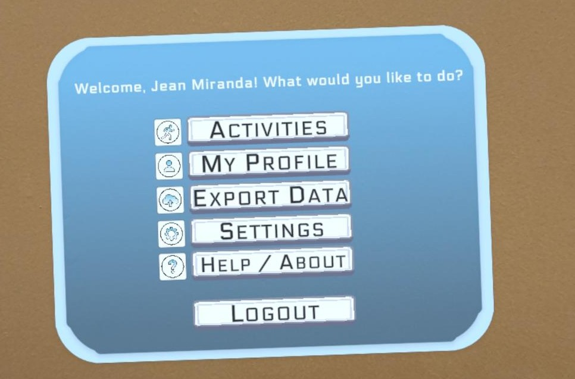

# 🧩 AR Communication Software for Children with Autism

A Computer Engineering Capstone Project — **Completed December 2025**

---

## 📖 Overview

This project delivers a complete Augmented Reality (AR) communication software system designed for children with Autism Spectrum Disorder (ASD), particularly those who are non-verbal or minimally verbal. The solution combines a standalone AR application for Meta Quest 3S headsets with a companion web application for clinical data analysis.



**Core Components:**

- **Standalone AR Application:** Three therapeutic activities (Object Identification, Sentence Builder, Emotion Explorer) with full data logging
- **Companion Web Application:** Data visualization dashboard for therapists and caregivers
- **Offline Database System:** SQLite database with JSON export functionality
- **Clinical Analytics:** Progress tracking and behavioral assessment tools

---

## 🎯 Project Objectives

✅ Develop a functional standalone AR application for Meta Quest 3S headsets  
✅ Create three distinct therapeutic/educational activities  
✅ Implement comprehensive session data tracking and storage  
✅ Build a companion web application for clinical data visualization  
✅ Enable secure data export and analysis workflow  

**Status:** All objectives successfully completed (December 2025)

---

## 🔧 Technology Stack

**AR Application:**
- Platform: Meta Quest 3S
- Engine: Unity 3D
- Language: C#
- Database: SQLite (SQLite4Unity3D plugin)
- Build: Standalone APK

**Web Application:**
- Stack: XAMPP (Apache, MariaDB, PHP)
- Database: MySQL
- Format: JSON data import/export

---

## 📂 Repository Structure
```
AR-Communication-Software-ASD/
├── README.md                          # Project overview
├── docs/                              # Documentation
│   ├── Capstone I Poster.png          # Poster from Capstone I
│   ├── Capstone I Report.pdf          # The final report of Capstone I
│   └── Capstone II - Final Report     # The final report of Capstone II
│   └── Capstone II - Midterm Report   # The midterm report of Capstone II
│   └── Capstone II - Poster           # The poster from Capstone II
├── images/                            # Application screenshots
│   ├── app-dashboard.jpg              # AR app main dashboard
│   ├── activities/                    # Activity screenshots
│   └── web-app/                       # Web application screenshots
└── builds/                            # Application builds
    └── AR-Communication-ASD.apk       # Current release build
```

**Note:** The complete Unity project files and test builds are available in the [Releases](../../releases) section.

---

## 🌟 Key Features

### AR Application (Current Version)

**Therapeutic Activities:**
- **Object Identification:** Vocabulary building and object recognition
- **Sentence Builder:** Grammar comprehension and sentence completion
- **Emotion Explorer:** Emotional recognition assessment tool

**User Interface:**
- Account management (sign-up/login)
- Customizable difficulty levels
- Progress tracking and milestones
- Settings and audio controls
- Data export functionality

**Data Management:**
- Secure offline SQLite database
- Session metadata logging
- Individual response tracking
- JSON export for clinical analysis

### Companion Web Application

**Features:**
- Secure clinician authentication
- JSON data import and parsing
- Visual progress analytics
- Patient profile management
- Session history and performance charts

---

## 🚀 Implementation Highlights

**Database Schema:**
- `ChildAccount` - User profile data
- `ActivitySession` - Session metadata
- `ActivityResponse` - Detailed response logs
- `ActivityConfigPreset` - Difficulty configurations
- `ProgressMilestone` - Achievement tracking

**Clinical Workflow:**
1. Child completes activities on Meta Quest 3S
2. Session data logged to local database
3. Clinician exports JSON file from headset
4. Data imported to web application
5. Progress analyzed via dashboard visualizations

---

## 📊 Project Timeline

- **Phase 1 (Spring 2025):** Research and Design Documentation
- **Phase 2 (August - December 2025):** Full Development and Implementation
  - September 2025: Core AR framework
  - October 2025: Activities and database implementation
  - November 2025: Web application development
  - December 2025: Project completion and final delivery

---

## 👥 Contributors

- **Jean A. Miranda Vargas** — Computer Engineering Undergraduate
- **José L. Laboy Steidel** — Computer Engineering Undergraduate

---

## 📜 License

This project is intended for academic purposes only.

**If you wish to reference, use, or build upon this work, you must first contact the contributors for permission.**

---

## 📬 Contact

For inquiries, collaboration opportunities, or technical discussions:

- Jean A. Miranda Vargas: jmiranda166@email.uagm.edu
- José L. Laboy Steidel: jlaboy39@email.uagm.edu

---

## 🙏 Acknowledgments

We express our gratitude to:

- **Dr. Alcides Alvear Suárez (PhD)** — Our capstone advisor for guidance and mentorship
- **Meta Developer Community** — For comprehensive Quest 3S documentation and resources
- **Unity Technologies** — For robust AR/VR development tools
- **Capstone Peers and Engineering Students** — For feedback and collaborative support

---

## ⚠️ Disclaimer

This project utilized AI assistance tools during various stages of development. All AI-generated content was reviewed, validated, and integrated by the project contributors to ensure accuracy and alignment with project objectives.

---

**Project Status:** ✅ Complete  
**Last Updated:** December 2025
